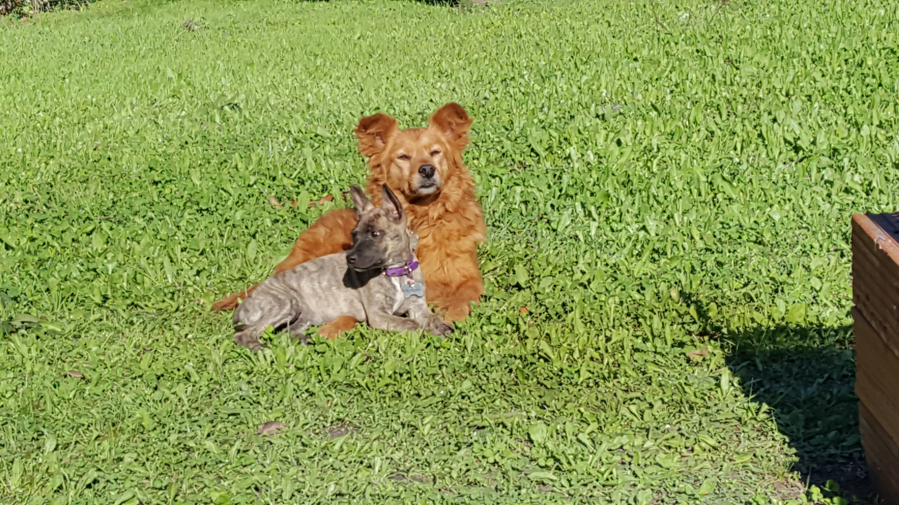

 Poco sabia a donde la llevarían,
 _Rascachula Cuerovaliente_ simplemente
 mas allá del bien y el mal existía,
 con rastas coloradas,
 cacique llena de marcas,
 símbolo de estatus reservado
 para las mas nobles y estoicas figuras
 políticas de antaño.

 Pocas cosas podrían
 quebrar el espíritu de _Rascachula_.
 Y Pocas cosas durante su vida
 realmente lo harían
 y esta, en definitiva,
 una de esas cosas no seria.

 Pues muchas fueron las lunas
 en que _Rascachula_ deambulaba,
 sola con su espíritu y su nobleza,
 y no fue su pericia en batalla ni su riqueza
 su mejor arma sino su capacidad de mirar
 y no pensar en lo que vendría,
 en mirarse adentro y entender
 que de verdad solo hay una sola
 _Rascachula Cuerovaliente_,
 fiera guerrera del espíritu callejero,
 enemiga numero uno de los carteros,
 una alfa y una omega,
 con mucha melena roja fuego
 pero con ojos buenos
 si tan solo un poco tercos.

 Y el honor de haber servido en batalla
 con _Rascachula_ me lo llevo a la tumba,
 cuando sea que la muerte me alcance,
 espero con un ápice del orgullo,
 dignidad y nobleza
 que _Rascachula Cuerovaliente_ me ensenó.

## Rascachula Cuerovaliente

> **Scratchula Bravehide** en ingles.

_Orden del León de Oro de la Casa de Nassau._

_Orden de San José._

_Orden de San Olaf._

_Orden de la Corona._

_Orden del Águila Roja._

_Héroe de batalla._

_General máximo del ejercito del fondo de la Legua._

_Comandante de las fuerzas del patio de mi casa._

### Apendice: Sobre el titulo de _Cuerovaliente_

Nadie sabe bien cuando _Rascachula_ obtuvo el titulo _Cuerovaliente_ pero
la leyenda cuenta que el mismísimo Zeus bajo de los cielos a entregárselo.

Otros cuenta que fue ganado tras muchas batallas.

La verdadera historia sigue siendo un misterio hasta el día de hoy...

